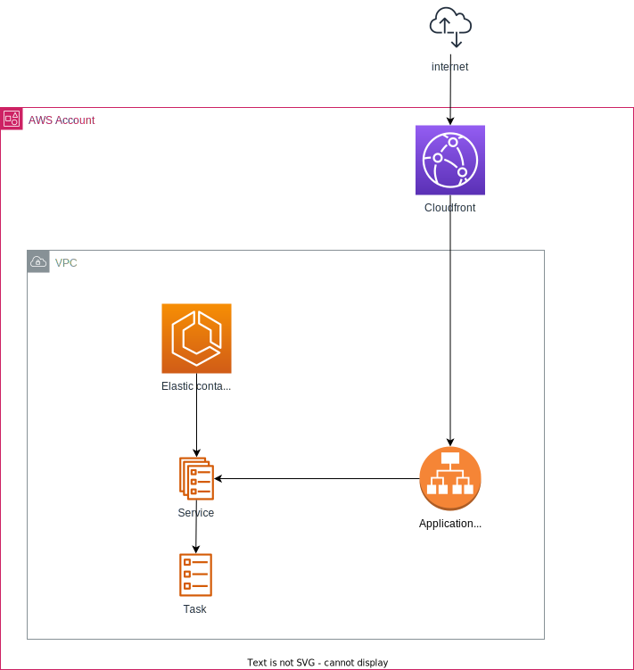

# Uitwisselings Mechanisme (UM) demo

Doel van dit project is het uitrollen en draaien van [UM](https://gitlab.com/vng-realisatie/um-pilot) in de AWS omgeving van Gemeente Nijmegen.
Dit project bevat de infrastructuur as code (IaC) om de containers uit te rollen in een AWS ECS cluster met fargate.

## Opzet AWS infrastructuur

De opzet hierboven maakt gebruikt van ECS met fargate services. 
- Elke service bestaat uit een aantal taken, deze taken zijn containers en worden gemanaged door AWS. 
- De loadbalancer weet elke containers waar draaien en zal verkeer naar de containers sturen. 
- Het is mogelijk meerdere services te koppelen aan dezelfde loadbalancer. 
- Het is dus ook mogelijk om meerdere taken onder een service te hebben. 

### Cloudfront en loadbalancer
Omdat de AWS loadbalancer naar het internet open moet staan is het nodig deze te beveiligen.
Zo kan het verkeer alleen via cloudfront naar de loadbalancer en niet direct.
[Zie de AWS documentatie hierover](https://docs.aws.amazon.com/AmazonCloudFront/latest/DeveloperGuide/restrict-access-to-load-balancer.html)
**Let op:** De header en waarde zijn niet geheim in deze repository, de waarde dient geheim gehouden te worden.

## Nuttig
- [Uitwisselings Mechanisme (UM) gitlab](https://gitlab.com/vng-realisatie/um-pilot)
- [Er is een tag gemaakt](https://github.com/GemeenteNijmegen/um-demo/releases/tag/hello-world-container) met een hallo-world demo in de begin fase van dit project. De code in de staat bij de tag bied een simpel voorbeeld van het draaien van een container op een ECS cluster en exposen van de service via een loadbalancer.
- [Er is nog een tag aangemaakt](https://github.com/GemeenteNijmegen/um-demo/releases/tag/hello-world-cloudfront) waarin een nginx hello-world container draait in combinatie met een cloudfront distributie. 