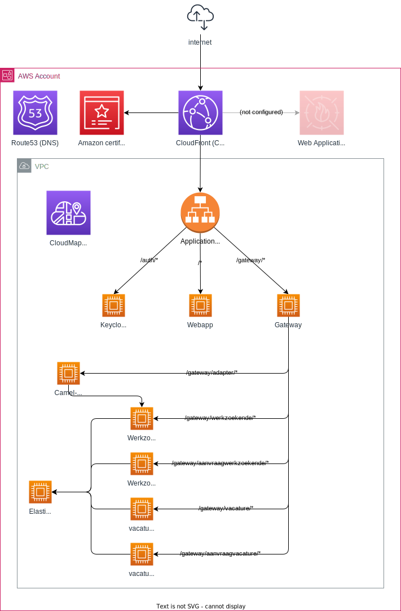
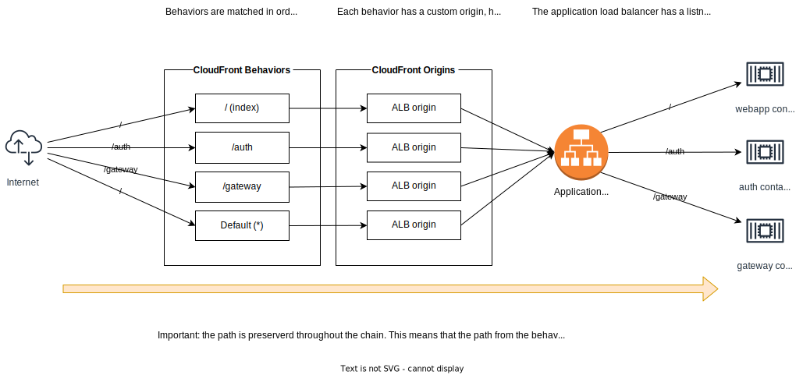

# Uitwisselings Mechanisme (UM) demo

Doel van dit project is het uitrollen en draaien van [UM](https://gitlab.com/vng-realisatie/um-pilot) in de AWS omgeving van Gemeente Nijmegen.
Dit project bevat de infrastructuur as code (IaC) om de containers uit te rollen in een AWS ECS cluster met fargate.

## Nuttig
- [Uitwisselings Mechanisme (UM) gitlab](https://gitlab.com/vng-realisatie/um-pilot)
- [Er is een tag gemaakt](https://github.com/GemeenteNijmegen/um-demo/releases/tag/hello-world-container) met een hallo-world demo in de begin fase van dit project. De code in de staat bij de tag bied een simpel voorbeeld van het draaien van een container op een ECS cluster en exposen van de service via een loadbalancer.
- [Er is nog een tag aangemaakt](https://github.com/GemeenteNijmegen/um-demo/releases/tag/hello-world-cloudfront) waarin een nginx hello-world container draait in combinatie met een cloudfront distributie. 
- [Presentatie met bevindingen](./docs/Opzet%20en%20bevindingen.pptx)

## Opzet AWS infrastructuur

De opzet hierboven maakt gebruikt van ECS met fargate services. 
- Elke service bestaat uit een aantal taken, deze taken zijn containers en worden gemanaged door AWS. 
- De loadbalancer weet elke containers waar draaien en zal verkeer naar de containers sturen. 
- Het is mogelijk meerdere services te koppelen aan dezelfde loadbalancer. 
- Het is dus ook mogelijk om meerdere taken onder een service te hebben. 

Detail overzicht architectuur

De plaat hieronder geeft weer hoe de UM-demo is opgezet en achter welke paden welke containers beschikbaar zijn.

## Ontwerp Besluiten en andere problemen

### CloudFront
Om toegang tot de applicatie te stroomlijnen wordt CloudFront gebruikt (vergelijkbaar met een reverse proxy). Alle requests vanaf buiten de CloudOmgeving komen hier langs hier kan ook caching plaats vinden. Aan de CloudFront distributie kan een Web Application Firewall (WAF) gekoppeld worden. Omdat het hier om een demo gaat is de WAF geconfigureerd. CloudFront wordt ook voorzien van een AWS issued certificaat voor HTTPS verbindingen naar buiten.

### Cloudfront en loadbalancer
Omdat de AWS loadbalancer naar het internet open moet staan (vereist door AWS) is het nodig deze te beveiligen.
Zo kan het verkeer alleen via cloudfront naar de loadbalancer en niet direct.
[Zie de AWS documentatie hierover](https://docs.aws.amazon.com/AmazonCloudFront/latest/DeveloperGuide/restrict-access-to-load-balancer.html)
**Let op:** De header en waarde zijn niet geheim in deze repository (de code is openbaar, dus de waarde van de header ook), deze waarde dient geheim gehouden te worden in een productie omgeving.

### Container to container communication
Omdat de containers (tasks) zijn ondergebracht in apparte (ECS fragate) services wordt container-container communicatie complexer.
Er zijn [drie opties om dit voor elkaar te krijgen](https://docs.aws.amazon.com/AmazonECS/latest/bestpracticesguide/networking-connecting-services.html)
- Service discovery (via CloudMap)
- Internal (inside vpc only) loadbalancer
- Service mesh
Deze opzet maakt gebruik van service discovery, op basis van DNS lookup in een private route53 subnet kunnen de verschillende services worden gevonden en geraadpleegd.
**Let op:** Omdat tasks kunnen stoppen en starten en DNS records een TTL hebben kan het zijn dat een DNS lookup uitkomst bij een container die niet meer bestaat. Hier moet rekening mee gehouden worden tijdens de applicatie ontwikkeling (retries). 

Service-to-service communicatie vind dan plaats door DNS lookup. Een url krijgt dan de vorm: `http://<service>.<cloudmap-dns-private-zone>[:<port>][/<path>]` bijvoorbeeld `http://werkzoekende-bron.um-demo.local:8080/gateway`. Hierin wordt de ECS service `werkzoekende-bron` benaderd via CloudMap, de CloudMap private DNS hosted zone heet in dit project `um-demo.local` ([code](./src/ContainerCluster.ts) method `constructEcsCluster`).

### Config file mounting
De UM containers maken veel gebruik van configuratie files die aan de container gemount worden. In AWS is dit lastiger omdat we de images niet zelf in beheer (willen) hebben.
Dit probleem geld voor veel containers omdat het gebruik van configuratie files erg is gestandaardiseerd.

Voor zover we hebben gevonden zijn er twee opties:
- Optie 1: ECS de image laten builden. ecs.ContainerImage.fromAsset(‘./image’). Zorgt er voor dat er een nieuwe container wordt gebouwd en gedeployed.
  - Nadeel: de container staat niet in ECR
  - Voordeel (bij lokaal gebruik zonder codepipeline): de CDK is slim genoeg om de container niet elke keer opnieuw te bouwen bij elke deployment, alleen als er wijzigingen zijn in de image/configuratie files in de asset directory.
- Optie 2: [een ecr-asset maken](https://docs.aws.amazon.com/cdk/api/v2/docs/aws-cdk-lib.aws_ecr_assets-readme.html), image wordt dan ‘onderwater’ in een ecr repo opgeslagen, heb je verder geen bemoeienis mee. Imagetag krijg je als property, en die kun je dan meegeven aan een taskdefinition.

Enkel optie 1 is tot nu toe in gebruik voor dit project. De CDK is slim genoeg om de verschillende lagen van de docker images te cachen zodat het image een keer gebouwd en uitgerold moet worden. Aanapssingen van de configuratie files zoals deze in deze repo worden gebruikt. Let wel: voor lokaal bouwen moet docker deamon beschikbaar zijn.

### URL paths 
Omdat een loadbalancer relatief duur is, is er voor gekozen de containers die beschikbaar moeten zijn vanaf het internet op te delen in verschillende paden binnen dezelfde loadbalancer. Omdat de loadbalancer beschikbaar is via CloudFront heeft dit wat gedoe opgeleverd in de configuratie van de verschillende onderdelen. De afbeelding hieronder beschrijft waar rekening mee te houden bij deze opzet.

Voor CloudFront is het belangrijk, afhankelijke van de behavior, om de caching op disabled en de origin request policy op `AllViewer` te zetten (zodat alle headers en query strings worden doorgegeven en niet gecached).

### ECS CPU architectuur
ECS kan zowel ARM als X86_64 (AMD64) architectuur containers draaien. Niet alle containers zijn beschikbaar in de juiste types. Container types kunnen geconfigureerd worden door `--platform=amd64` aan de FROM in de Dockerfiles mee te geven of door de ECS task definition aan te passen.

### Virtual Private Cloud (VPC)
De containers draaien in een VPC netwerk (aantal subnets binnen een AWS account). De VPC bestaat al en wordt geconfigureerd bij het aanmaken van een account. Hiervoor worden een aantal parameters gebruikt, dit maakt dat deze applicatie zoals deze nu is opgesteld alleen in AWS acconts van gemeentenijmegen gedeployed kan worden. 

## Bevindingen per UM container

### Keycloak
- In de UM repo voor keycloak (https://gitlab.com/vng-realisatie/um-pilot/keycloak) wordt gebruik gemaakt van een oude keycloak container build. Deze draait niet op AWS omdat hier de ARM64 architectuur wordt gebruikt (opgelost door de nieuwe versie van de image te gaan gebruiken zie: https://hub.docker.com/r/keycloak/keycloak). Een groot nadeel hieraan is dat de configuratie (env vars) totaal is veranderd.
- Omdat de Keycloak in de AWS omgeving achter cloudfront en loadbalancer draait is de configuratie extra lastig. Uiteindelijk bleek de volgende configuratie te werken:
  - KC_PROXY  = edge 
    - Dit zet de proxy modes voor de keycloak container. Edge betekent dat de container te benaderen is via http vanaf de loadbalancer. Dit gebeurt in het subnet van de AWS VPC en toegang tot de loadbalancer loopt via HTTPS.
  - KC_HEALTH_ENABLED = true
    - Enable healtcheck endpoints in de container (endpoint moet doorgegeven worden aan de loadbalancer)
  - KC_HOSTNAME_STRICT = true
    - Zorgt er voor dat keycloak de hostname niet uit de binnenkomende requests haalt maar uit de configuratie
  - KC_HOSTNAME_STRICT_BACKCHANNEL = true
    - Zorgt er voor dat keycloak voor de andere endpoints (backchannel endpoints) dezelfde hostname gebruikt uit de configuratie als de frontend. 
  - KC_HTTP_RELATIVE_PATH =  /auth
    - Zorgt dat de keycloak instalatie in de container onder het path /auth te berijken is. (default is de root, maar omdat we keycloak aan de loadbalancer en in cloudfront op het path /auth exposen wordt dit in de container ook gedaan)
  - KC_HOSTNAME_URL = https://um-demo.csp-nijmegen.nl/auth
    - Zet de url waarop keycloak beschikbaar is zodat de frontend dit kan gebruiken
  - KC_HOSTNAME_ADMIN_URL = https://um-demo.csp-nijmegen.nl/auth
    - Zet de url waarop de keycloak admin console beschikbaar is (nodig voor de frontend)
- Om keycloak achter cloudfront en een loadbalancer te kunnen draaien is de configuratie van cloudfront en de loadbalacner belangrijk. Deze moete de juiste X-Forwarded-* headers mee sturen. Dit gebeurt vanzelf bij de loadbalancer. Voor CloudFront is het expliciet nodig de caching op disabled te zetten en de origin request policy op `AllViewer` te zetten (zodat alle headers en query strings worden doorgegeven en niet gecached).
- De realm configuratie kon 'geleend' worden van de bestaande UM Keycloak configuratie (hierin zitten ook users). Hierin moeten de OpenID Connect client gegevens worden aangepast zoals de valide redirect urls. Ook moet de allowed origins voor de admin console aangepast worden zodat de console te bereiken is via het /auth/admin endpoint. Daarnaast bevat UM nog enkele confugriaties specifiek voor de werking van de applicatie.  

### Applicatie containers (Java)
Voor alle Java containers geld dat deze beschikbaar zijn achter paden in de gateway. Om de paden aan te passen wordt in een [Dockerfile](./src/containers/profielen-bron/Dockerfile) het argument `--server.servlet.context-path=/gateway` mee gegeven. 

### Elasticsearch 
Deze containers is nodig voor alle java (applicatie) containers.
Een intressante test zou zijn om de managed elasticsearch van AWS te gebruiken.

Er zitten wat haken en ogen aan het draaien van elasticsearch in een container:
- De juiste container architectuur moet gebruikt worden
- Container size (memory intensive), daarom beperken geheugen ES_JAVA_OPTS `-Xms512m -Xmx512m`
- Container nr of open files (ulimit) moet opgehoogd worden in de ECS task definition
- Container disable virtual memeory areas (mmap), omdat deze limiet niet verhoogd kan worden moet mmap uitgeschakeld worden. `node.store.allow_mmap=false`

## Gateway
[Configuratie](./src/containers/gateway/kong.compose.yml) is volledig gecustomized
- Healcheck toegevoegd (nodig voor loadbalancer), hiervoor moest een extra plugin geinstalleerd en geconfigureerd worden.
- Door gebruik van verschillende paden voor de containers (zie detail architectuur) moeten alle paden in de configuratie worden aangepast.

Een intressante test zou nog zijn om de gateway container te vervangen door een AWS API gateway. Dit kan de kosten drukken door niet voor de volledige uptime van een container te betalen maar obv. pay-by-usage.

## Camel adapter
Bevat nog geen functionaliteit. 
Configuratie door extra parameters mee te geven aan Spring boot startup (om debug aan te zetten en app context te veranderen).

## Webapp
- Geen opmerkingen over configuratie / opzet
- Mogelijkheid om niet via Nginx te serveren maar direct vanuit S3 (scheelt een container en dus kosten)
