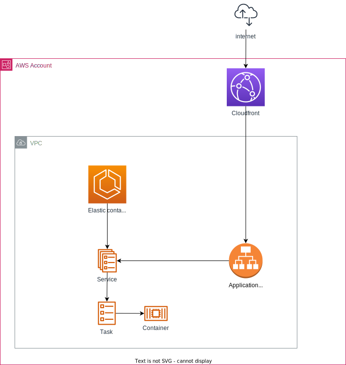

# Uitwisselings Mechanisme (UM) demo

Doel van dit project is het uitrollen en draaien van [UM](https://gitlab.com/vng-realisatie/um-pilot) in de AWS omgeving van Gemeente Nijmegen.
Dit project bevat de infrastructuur as code (IaC) om de containers uit te rollen in een AWS ECS cluster met fargate.

## Opzet AWS infrastructuur

## Nuttig
- [Uitwisselings Mechanisme (UM) gitlab](https://gitlab.com/vng-realisatie/um-pilot)
- [Er is een tag gemaakt](https://github.com/GemeenteNijmegen/um-demo/releases/tag/hello-world-container) met een hallo-world demo in de begin fase van dit project. De code in de staat bij de tag bied een simpel voorbeeld van het draaien van een container op een ECS cluster en exposen van de service via een loadbalancer.